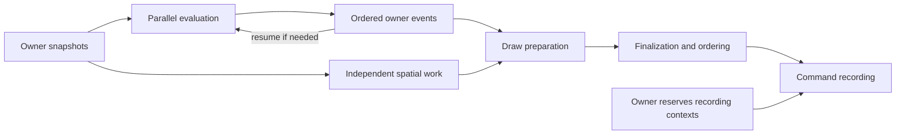

# Execution and work graphs

[Guide index](README.md)

## Own one runtime and configure the complete budget

An application normally owns one `SWRuntime` and gives subsystems reusable
`SWLane` handles. Lane clones select an existing runtime and execution class;
they neither create pools nor keep workers alive after the runtime is dropped.

`SWRuntimeConfig::new` takes an aggregate worker budget and three
`SWWorkerConfig` entries in **Low, Mid, High** order. Each class currently requires
at least one worker. The sum may be below the budget but cannot exceed it.
Account for the main thread, renderer/provider threads and other runtimes when
choosing this budget; the number of logical CPUs is not automatically the number
of additional workers an application should create.

| Mechanism | Meaning | Host decision |
| --- | --- | --- |
| `SWExecutionClass` | Separate workers and queues for Low, Mid and High. | Which capacity class should execute this stage? |
| `SWThreadPriority` | Optional OS worker priority request. Setup can fail. | Is the request appropriate and supported on this platform? |
| `SWPriority` | Configured rank for resource demand; smaller ranks come first within the resource route. | Which pending resource matters more to its consumers? |

These are distinct controls. A resource priority change does not move a job to
another execution class, create workers or interrupt running work. High is not a
real-time deadline guarantee. A common application policy assigns current-frame
preparation to High and throughput-oriented preparation to Low, using Mid for
selected services. Class assignment follows stage latency and ownership needs,
not just a file extension or subsystem name.

Construction is fallible. All workers finish setup before the runtime becomes
available; startup failure joins workers already created. `with_worker_setup`
may install per-worker state, but its hooks can run concurrently and cannot wait
for another hook or work on the runtime being constructed. Helping callers have
not run these hooks.

`SWRuntime::builder(config).build()` enables scoped execution. Enable owned
scheduling explicitly with `with_owned_limits`. Additional capacity, demand and
physical-access policies are opt-in builder settings, described in
[resources](resources.md) and [rendering](rendering.md).

Sources: [configuration](../src/runtime/config.rs), [builder](../src/runtime.rs).

## Choose the lifetime before choosing the operation

| Need | Available API | Boundary |
| --- | --- | --- |
| Two transferable borrowed branches | `SWLane::join` | Both branches and captures settle before return. |
| Transferable work overlapping caller-only state | `join_with_owner` | Owner closure executes on the calling thread; both branches settle before return. |
| Disjoint borrowed slices | `for_each_chunk` | All mutable chunks settle before return. |
| Shared read-only input | `for_each_read_chunk` | All read-only chunks settle before return. |
| Work outliving the submitting call | `try_spawn` and related methods | Accepted operation and output are `Send + 'static`; explicit outcome observation. |
| A retained wave | `group`, `try_spawn_in`, `SWGroup` | Membership is sealed, then accepted members settle. |
| Successive retained waves | `batch`, `SWBatch::begin` | Previous wave must be sealed and complete before renewal. |
| Prerequisite-gated successor | `try_spawn_after`, `try_spawn_after_in` | No worker is occupied while waiting for prerequisite readiness. |
| Typed result transformation | `SWTask::try_then`, `SWShared::try_then` and outcome/fallible variants | Ownership or shared observation moves into the accepted continuation. |

Borrowing is useful when a lexical join matches the real consumer boundary. Do
not turn an entire frame into many immediate joins if later work could have been
admitted early and overlapped. Owned work is useful when the producer should
return to other responsibilities while the operation remains in flight.

Borrowed operations can execute on workers or assisting callers. Both branches
of a join must remain valid when execution is serial. In particular, the owner
branch of `join_with_owner` must not wait through a side channel for the worker
branch: without a foreground slot, owner-then-worker serial execution is legal.
Same-lane nesting is supported; blocking scoped calls across lanes or runtimes
are rejected. Express cross-class transitions with owned dependencies instead.

Chunk callbacks receive a stable starting index. This identifies data placement,
not callback execution order. A panic does not roll back already mutated items;
remaining scoped chunks settle before the caught panic is returned. The host
must decide whether the partially updated domain state can be used.

Source: [scoped operations](../src/execution/scope.rs).

## Build a dependency graph with useful overlap

A generic frame might have the following arrangement:

The event loop represents application semantics, not an automatic scheduler
cycle. Each actual generation must have an acyclic dependency graph. The owner
may admit a new evaluation wave after delivering an event from the previous one.

Admit a successor behind its prerequisites as soon as its inputs and lifetime
are represented safely. The submitting thread need not first wait for those
prerequisites. Reserve contexts and submission order while unrelated CPU work
runs. Wait at the real consumer boundary rather than after each submission.

Use task completion for one producer and group completion when the next stage
requires the whole wave's settlement. A completion token carries status, not the
result data: capture the corresponding task/shared handle or retain the data
owner separately. GPU completion needs its own boundary.

`SuccessOnly` suppresses a successor if any prerequisite fails.
`OutcomeAware` permits the successor to run on terminal failure too; its closure
must inspect the relevant outcomes. This is useful for recovery and cleanup.
Do not make a group member depend on its own group's completion. Arbitrary
cycles through callbacks, locks or multiple groups are not generally detected.

The [frame example](../examples/frame_pipeline.rs) admits finalization before
waiting for preparation, uses two distinct groups and publishes on an owner.

Source: [owned submission](../src/execution/owned.rs).

## Seal membership and preserve failures

`SWGroup::seal` closes membership. Until sealing, even a group with no pending
jobs is not complete. An empty sealed group succeeds. Group status is successful
only if all accepted members succeed; a member failure yields
`PrerequisiteFailed` at the aggregate boundary. Inspect individual outcomes for
specific errors.

A rejected submission never became a member and does not fail the group. The
caller must retain that admission failure. Otherwise, a partially admitted
phase can appear to be a successful complete phase. [Coherent publication](resources.md)
explains one composition for workloads that cannot start partially.

Dropping a group or batch does not seal, cancel or wait. Explicitly seal every
wave even on admission failure. `SWBatch::begin` reuses eligible internal storage,
but retained handles keep observing their original wave. It neither returns
mutable job inputs nor resets domain buffers for you.

Sources: [groups](../src/execution/group.rs), [batches](../src/execution/batch.rs).

## Helping is explicit and restricted

Owned jobs default to `SWCallerEligibility::WorkerOnly`. Mark a job
`CallerEligible` only when it is safe on any permitted helping caller. This rules
out assumptions about worker-local indices, worker-only TLS, thread-affine
destruction and implicit access to a worker's scratch buffer.

`SWGroup::help_ready` attempts one ready eligible member of that exact group.
It does not recursively help every prerequisite group. If the needed producer
is in another group, that producer must have its own progress route.
`wait_helping` helps and then parks until the group settles. It does not pump
owner callbacks or a native event loop. It is suitable only when the remaining
work can finish without services that the waiting caller must provide.

An invocation must not wait on its own group or on a group that needs its
suspended enclosing invocation. A participating worker must not become the sole
blocked executor needed by remaining worker-only jobs. Some invalid contexts are
rejected, but application dependency design remains responsible for liveness.

`try_spawn` never executes the operation inline on the submitting caller.
`submit_or_run` may do so on runnable saturation, for explicitly eligible work.
It still needs record and edge capacity; backend handoff pressure alone does not
trigger inline execution. Choose this route only where synchronous execution is
acceptable for latency, stack depth and reentrancy.
