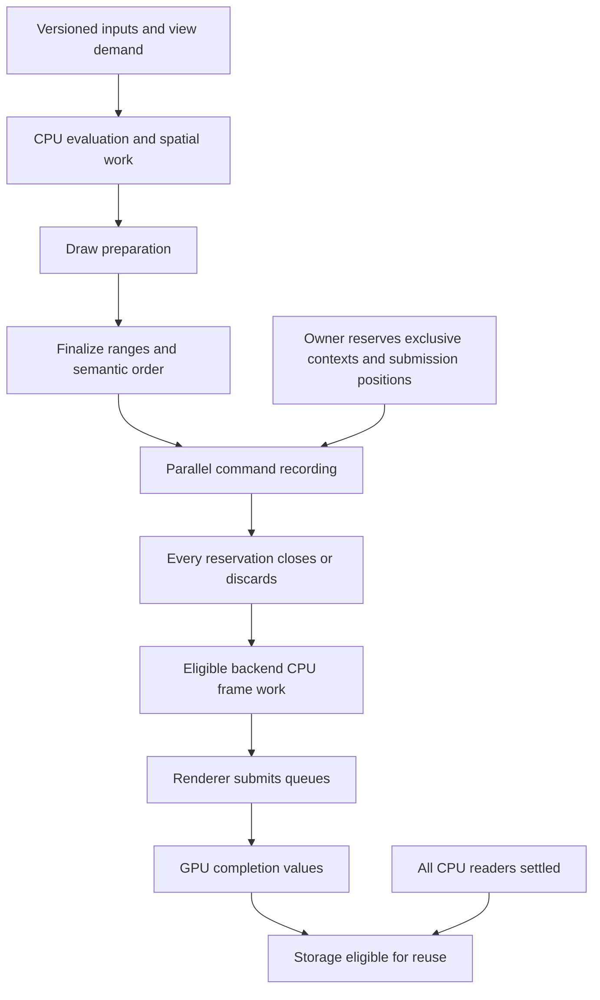

# Rendering and external access

[Guide index](README.md)

## Connect CPU stages without moving graphics ownership

Solworker can execute CPU preparation and command recording. The renderer keeps
its device, resource state, command allocators/pools, queue submission and
presentation rules. The same separation applies to Vulkan or Direct3D 12;
Solworker supplies no graphics backend and does not choose a graphics library.

An application can organize a frame as follows. These are conceptual stages,
not supplied renderer APIs:

Use independent groups or completion tokens where these stages have distinct
consumers. Admit recording behind preparation/finalization when its contexts can
be reserved early. The owner can prepare unrelated work while those jobs run.
A dependency graph is useful only if domain inputs and mutation rules permit
the overlap it represents.

Preserve owner-only event delivery between worker waves when required. Multiple
views or passes should consume the appropriate version rather than accidentally
advance a simulation clock repeatedly. Offscreen objects can still have event,
shadow, lighting or other consumers; visibility alone is not a universal reason
to skip their CPU work.

## Separate reserved contexts from useful parallel width

Keep a renderer-owned pool of reusable recording contexts, then choose how many
chunks are useful for each pass. Small passes may use fewer active chunks than
the retained capacity. Share the recording budget across views and passes
instead of giving every view the entire available pool simultaneously.

Choose initial width using actual High capacity, available exclusive contexts,
ready work and pass dependencies. Total Low+Mid+High thread count is not the
recording capacity of High. There is no universal chunk size or view divisor in
the crate.

Preserve contiguous ordinary ranges when ordering and local state reuse matter.
Keep compatible grouped runs intact unless the renderer explicitly supports
splitting them. Define which active partition owns leading/trailing work and
handle the single-partition case without duplication. Empty passes still need
defined reservation and completion behavior.

More partitions can reset binding caches, repeat palette packing, increase
temporary storage and produce more command lists. Count useful draws, grouped
runs, packing bytes and recording invocations alongside time. A record count is
not necessarily a draw count or a uniform unit of CPU work.

## Keep recording order independent of worker completion

Reserve logical submission positions on the renderer owner before dispatch.
Workers fill the assigned positions; the renderer consumes them in the required
order. Finishing first does not grant permission to submit first. This matters
for ordered passes, transparency and barriers as well as visual reproducibility.

Each reserved context must reach exactly one disposition: usable closed work or
discarded work. Inactive chunks, refused admission, prerequisite suppression,
panic and cancellation all need a disposition. Keep host-owned guards that can
settle never-invoked operations. A group succeeding does not establish that an
attempted but rejected reservation was handled.

Exclusive command-pool/allocator access and lifetime belong to the renderer.
Caller-helpable recording must also be legal on the helping thread; a worker
index is not enough to select a safe pool. Avoid pointers to stack-owned frame
state in escaping jobs. Retain owned frame state, or use a scoped boundary that
provably ends all borrows before return.

## Backend CPU completion and GPU retirement are distinct

After recording, some backend preparation or finalization may be worker-safe.
Audit each operation's queue, window-system, callback and owner requirements
before moving it to a CPU lane. Keep the backend CPU group separate from the
GPU fence or completion values covering actual submitted use.

For each reusable frame slot, identify:

| Obligation | Required evidence before reuse |
| --- | --- |
| CPU evaluation/preparation readers | Their invocation/group and domain-reader ownership has settled. |
| Recording contexts | Every reserved operation has closed or discarded; no CPU recording still accesses the context. |
| Backend CPU work | Its own completion boundary and cleanup have settled. |
| Submitted graphics/compute/copy uses | The exact queue completion values or fences covering those uses have retired. |
| Other retained users | Their leases or independent lifetime proofs have ended. |

A single fence can cover several uses only if the renderer's synchronization
design establishes that relationship. CPU completion does not flush a GPU queue,
and a device fence does not complete unrelated CPU work. Frame number advancement
alone proves neither condition.

Frame overlap requires enough distinct live storage for frames in flight. Keep
current/history data versioned, prevent writers from reusing storage still read
by an older frame, and reset pools only after both CPU and GPU obligations end.
The host chooses whether to wait, grow within a bound, defer or drop optional
work when no reusable slot is available.

## Represent physical access only where it crosses SW lifetime accounting

The external-access API represents retained storage exposed to a provider or
device. It does not submit I/O, poll fences or generate barriers.

1. Configure `with_external_capacity` and, if used, declared capacity policy.
2. Call `prepare_external` while the resource is still exclusively owned and
   unexposed. Rejection returns it unchanged.
3. Call `activate` before exposing access. Activation is fallible and returns
   the prepared resource on rejection.
4. The adapter may use unsafe `as_mut_ptr` only while preserving address,
   aliasing, allocation and lifetime requirements for every accessed region.
5. Retain the active ticket until every foreign/device access and callback has
   ended and required memory visibility has been established.
6. Then use unsafe `acknowledge_release` to return a retained CPU-visible value,
   or unsafe `release` to destroy it on a legal thread.

A stable wrapper address does not prevent a nested vector from reallocating.
An adapter must cover the actual memory exposed to the device/provider. Pointer
access and acknowledgement are unsafe because the crate cannot verify foreign
access or completion.

Dropping an active access ticket records an orphan and retains the resource and
charge; it does not make potentially active memory safe to free. Cancellation,
timeout and logical producer completion do not acknowledge physical release.
Device failure needs a backend-specific end-of-access proof, not a fabricated
successful fence value.

When transferring the released resource to a logical provider result, use
`SWProducer::complete_retained` and configure that producer's
`retained_bytes: 0` to avoid reserving another output charge. If logical
cancellation already won, completion returns the retained resource to the
provider for appropriate cleanup.

Source: [physical-access contracts](../src/external/physical.rs).
